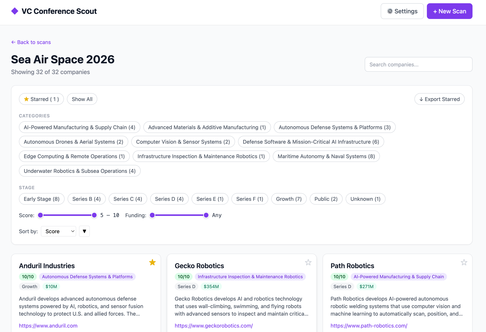

# VC Conference Scout

> I hate how long it takes to prepare for conferences. Hours and hours of identifying the right companies among thousands of attendees, cross-referencing them with my thesis, and trying to figure out which 30 are actually worth my time. So I built this.

VC Conference Scout takes a conference's attendee list (a URL to scrape, or a CSV you upload), runs every company through Claude using **your** investment thesis, and gives you back a filterable, scored shortlist with funding stage, location, founding year, and a one-sentence "why it's relevant" — for hundreds of companies in a few minutes.

It's a self-hosted tool. You bring your own Anthropic API key. Your data never leaves your machine.



---

## What it does

1. **Scrape** an attending-companies page (or load companies from a CSV/TXT file).
2. **Pre-filter** out the obviously-not-a-startup names (Fortune 500, big banks, consulting firms, VCs, associations).
3. **Classify & score** every remaining company against your thesis using Claude. Each company gets a 0–10 relevance score and a one-line reason.
4. **Enrich** the top 30 candidates via Claude's web search tool: founded year, funding raised, stage, HQ, what they actually do, why they're innovative.
5. **Auto-categorize** the final shortlist into 8–12 categories tailored to *this specific dataset* (or define your own).
6. **Browse** in a clean web UI: filter by category, stage, funding, score range; star favorites; export starred companies to CSV.

---

## Why this exists

The night before HumanX 2026 I had a list of ~3,400 attending companies and roughly zero hours to read about all of them. I needed:

- A way to throw out the 80% that obviously don't fit my thesis (big tech, banks, consulting firms, other VCs).
- A way to score the remaining 20% by how well they actually match what I invest in — not generic relevance, *my* thesis.
- A way to look up funding stage, founding year, and HQ without opening 600 Crunchbase tabs.
- A way to take notes and star the ones I actually wanted to meet.

Two hours and ~$8 of Claude API spend later I had a filterable shortlist of 568 companies, with the top 30 fully enriched. This is that tool, generalized so any VC can point it at any conference.

---

## Quickstart

```bash
git clone https://github.com/arbiterFF/vc-conference-scout.git
cd vc-conference-scout
pip install requests beautifulsoup4
python3 server.py
```

Open http://localhost:8081

1. Click **⚙ Settings** → paste your Anthropic API key → click **Save Key**.
2. Write your investment thesis in the **Profile** field. Or paste your firm's website URL and click **Extract from URL** — Claude will read the site and draft a profile for you.
3. Click **+ New Scan** → give it a name → choose source:
   - **From URL**: paste the conference's "attending companies" page URL
   - **CSV upload**: drop a CSV/TXT file (one company per line, or a column called `name`/`company`)
4. Choose **Auto-generate** categories (recommended) or **Manual**.
5. Hit **Start Scan**. Watch the progress bar. Browse the results when it's done.

---

## Configuration

Stored in your browser's localStorage (never on disk on the server):

| Setting | Purpose |
|---|---|
| Anthropic API Key | Your `sk-ant-...` key. Used for all Claude calls. |
| VC Profile / Thesis | Free-text description of what you invest in. Injected into every classification prompt. |

Stored on disk per scan in `scans/<scan-id>/config.json`:

| Field | Purpose |
|---|---|
| `name`, `url`, `selector` | What to scrape |
| `profile`, `categories` | Scoring + bucketing rules |
| `auto_categorize` | If true, regenerates categories from the actual results |
| `source` | `url` or `csv` |

Your API key is only kept on disk for the duration of a scan, then automatically stripped from the config file when the scan completes.

---

## Architecture

```
vc-conference-scout/
├── scout.py        # Pipeline: scrape → filter → classify → enrich → categorize
├── server.py       # Multi-scan REST API + static SPA host
├── index.html      # Single-page app: home, new scan, settings, scan detail
└── scans/
    └── <scan-id>/
        ├── config.json
        ├── companies.json   (only when CSV-uploaded)
        ├── results.json
        ├── starred.json
        ├── progress.json
        └── scout.log
```

Each scan runs as a detached subprocess writing `progress.json` for the UI to poll. Multiple scans can run in parallel.

---

## How the scraper works

If you give it a URL, it tries two strategies:

1. **CSS selector** — if you provide one (under "Advanced"), it's used directly.
2. **Auto-detect** — finds the parent element on the page whose direct children look most like a list (≥30 children, mostly short text, no `<br>`-separated noise). This works on most conference attending-companies pages without any tweaking.

If auto-detect fails, open the page in your browser, inspect the company names, and provide a CSS selector like `.attendee-list .company-name`.

CSV uploads skip the scraping step entirely.

---

## Why am I only seeing a few hundred companies out of thousands?

That's the classifier doing its job. The pipeline is a funnel:

```
3,433 scraped
  ↓ pre-filter (drops ~200 obvious mega-corps, VCs, consulting firms)
3,240 candidates
  ↓ Claude classify  ← THE BIG CUT
  ↓ keeps only type=startup|growth AND relevance ≥ 5
  568 shown in the UI
```

Most companies at any conference are mature businesses, service providers, banks, VCs, or simply unrelated to your thesis. The classifier reads each name against your profile and drops anything it scores below 5/10 or classifies as `mature` / `unknown`. The UI's score slider also defaults to 5–10 — so even matches at the low end show by default, but nothing below.

If you want a longer list, edit `scout.py` → `batch_classify()` and lower the `relevance >= 5` threshold (or remove the `startup|growth` type filter to keep mature companies too).

---

## Cost

Each scan with ~3,000 attendees costs roughly **$5–10** in Claude API spend:
- Classification: ~17 batches × ~$0.10 each
- Enrichment of top 30 (with web search): ~$0.10–0.20 each
- Auto-categorize (if enabled): ~$0.50

You can lower this by enriching fewer companies or skipping the auto-categorize step.

---

## Roadmap / contributions welcome

- Hosted SaaS version with sign-in (no clone-and-run required)
- Background re-scoring with enriched context (`rescore.py` from the original Manifest version)
- Enrich-all (not just top 30) for power users
- LinkedIn / Crunchbase enrichment
- Multi-conference dedup (track companies you've already evaluated)
- Notes per company

PRs welcome. The whole thing is ~1,500 LOC across 3 files; it's meant to be hackable.

---

## License

MIT. Built because hand-scrolling 3,400-company lists at 1am the night before a conference is no way to live.
